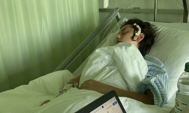

+++
title = "Sprich über deinen Schicksalsschlag, es hilft"
date = "2023-05-02"
draft = false
pinned = false
image = "img_1423.jpeg"
+++
 



Ein bösartiger Hirntumor war die schwere Krankheit, mit welcher Sarah zu kämpfen hatte. „Darüber reden hilft“. Es befördert einen von der schlimmen Realität wieder auf die richtige Bahn. Ein Schlag ins Gesicht wie diese schreckliche Diagnose, verändert nicht nur die Lebensweise, sondern auch die Identität.



Stille, welche die Zeit der Ungewissheit endlos erscheinen lässt. Diese ist nicht für immer. Der Schreck platzt wie ein lauter Knall in die Gedankenleere und hinterlässt eine Narbe, ein Abbild  dieser Geschichte, die zu jeder Zeit ersichtlich ist. Ein solch schwerer Schicksalsschlag prägt und verändert das Leben augenblicklich. 

Ich sehe die junge, aufgestellte Frau mit den glänzenden Augen vor mir, wie sie sich von einem dramatischen epileptischen Anfall bis schlussendlich zur befreienden letzten Chemotherapie durchschlägt. Trotz der schwierigen letzten Jahre  strahlt mir ein Lächeln entgegen. Es erzählt viel über den dazugehörigen Menschen und zeigt sich mittlerweile mit deutlicher Gewissheit. So war es nicht immer. 

**Ein einschneidendes Erlebnis**

Der Prozess der Verarbeitung und Akzeptanz sind entscheidend. Er ermöglicht den Überblick auf den steinigen Weg der hinter, sowie dem beschwerlichen der noch vor einem liegt. Die Offenheit, die Sarah während des Interviews ausstrahlt, geleitet eindrucksvoll  durch das ernste Thema. Manche verschweigen die unschönen Dinge und Erinnerungen in ihrem Innern, um sich selbst und anderen nicht die Wahrheit preiszugeben. Die Realität zu verdrängen, verhindert, wie eine grosse Mauer, welche mit vielen Hindernissen und Ungewissheit versehen ist, mit der Krankheit voranzukommen. Unter der glatten, geschmeidigen Oberfläche wirkt dumpf und verschwommen die Angst. 



In der Schweiz sind im 2022 670 Menschen an einem bösartigen Hirntumor erkrankt. Hirntumore können in prinzipiell jedem Alter vorkommen. Im 2022 sind 530 Personen daran gestorben.

 

**Wie sich die Pfade wieder zusammenführen**

Doch nicht bei Sarah, so wie sie im Interview ganz klar und aufgestellt ihre Geschichte schildert. Wir sitzen uns gegenüber an meinem Esstisch, auf welchem unsere angetrunkenen Kaffees stehen. Draussen scheint die Sonne, sie kitzelt uns leicht in den Augen. Über soziale Medien kommuniziert Sarah ihre Erkrankung eben so offen wie im direkten Gespräch. Sie nimmt ihre Follower mit in ihren Kampf gegen den Tumor, mit Bildern und Videos von ihrem Haarverlust nach Operation und später Strahlentherapie, sowie Einblicken in die Krankenhausaufenthalte. Es liegen Jahre mit Tiefen, Wochen ohne Aussichten, Stunden ohne Schlaf und Momente voller Tränen hinter ihr. Mit viel Energie und positiver Lebenseinstellung übersteht sie die sehr belastenden Therapien und deren Nebenwirkungen. Die Protonentherapie sowie die folgende Strahlentherapie welche Sarah nun hinter sich hat, beinhalten nicht nur viele Reisen nach Würenlingen, Ruhe, Geduld und Nervenstärke, sondern auch Schmerzen an der betroffenen Stelle an der linken Schläfe, wo heute, leicht versteckt unter den spriessenden Haaren, die Narbe durchscheint. 

Es ist keine leichte Reise, welche die von der Diagnose betroffen Personen bewältigen müssen. Der Alltag wird seziert und es ergibt sich ein völlig neues Bild vom Leben. Wie Sarah eindrücklich erzählt, bilden ihre Familie sowie ihre Freunde die sichere Unterlage ihres Pfades. *„Wie meine Familie und meine Freunde mich unterstützt haben ist nicht selbstverständlich“*. Ihr Blick schweift kurz aus dem Fenster, dort  beobachtet sie mit nachdenklichem Gesicht einen kleinen Vogel. Das Schicksal von Sarah verändert ihre Identität. Nach dem Blitz der Epilepsie erscheint nichts ist mehr sicher. Was geschieht morgen, was ergibt sich erst in ferner Zukunft? 

> *„Ich habe gelernt dankbar zu sein, für alles, was man hat und wie es einem geht“.*

Ich kenne Sarah schon länger und erlebe sie bereits vor dieser Diagnose als optimistische Person. Trotz Rissen in ihrem Leben, ist keine grundlegende Veränderung ihrer Persönlickeit zu bemerken. Ihre  positive Identität hat sich sogar verfestigt.  Am Schluss des Interviews, steht der glücklich und sichere Gesichtsausdruck, ein Lächeln immer noch in ihrem Gesicht. Sie hat die Übereinstimmung mit ihrem Leben gefunden.