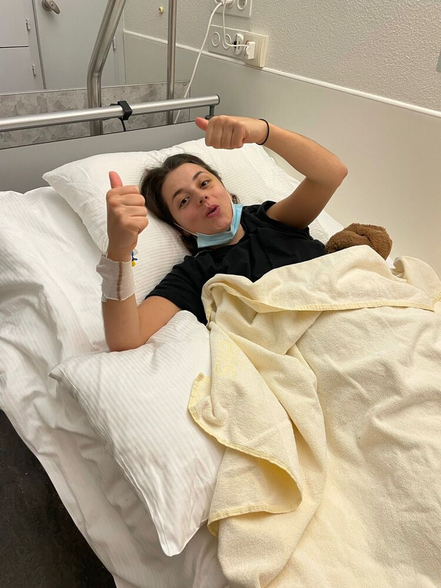
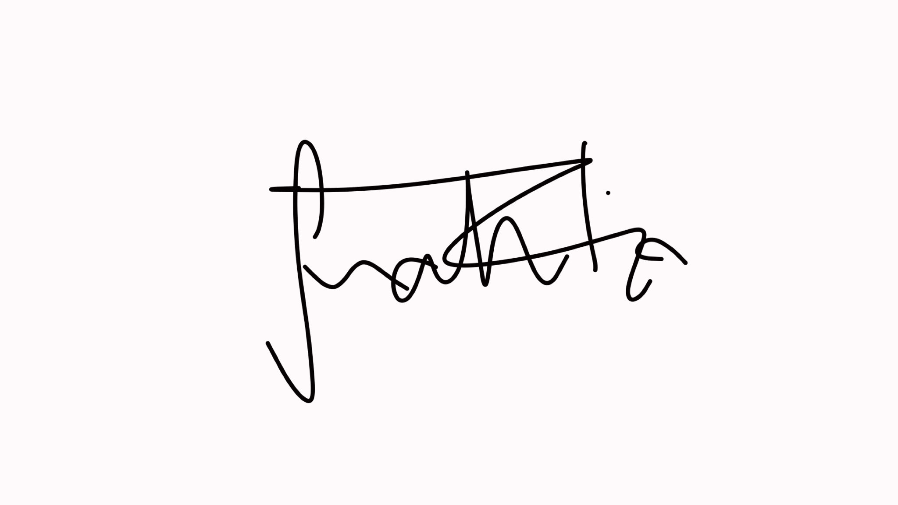

+++
title = "„Darüber zu reden hilft“ - Wie sich die Identität eines Menschen nach einem Schicksalsschlag ändert"
date = "2023-03-19"
draft = false
pinned = false
image = "89db7cc0-e5fb-41e3-afa8-2f6657244c3c.jpeg"
description = ""
+++

> Die 20 jährige Maturandin Sarah Fiorenza hat erst kürzlich ihre letzte Chemotherapie beendet und spricht offen über ihren bösartigen Hirntumor und dessen Folgen.
>
>

**Wie geht es dir momentan?** 

Sarah: Also mir geht es momentan sehr gut. Im Jahr 2021 wurde bei mir nach einem epileptischen Anfall ein Hirntumor gefunden, später wurde herausgefunden, dass es sich um Krebs handelt. Jetzt habe ich bald meine letzte Chemophase hinter mir. 

> Am 31. Oktober hat alles begonnen und ich kann mich noch ganz gut daran erinnern, dass ich für den Test am kommenden Montag gelernt habe. Angefangen hat alles, als ich mich etwas komisch fühlte. Zur gleichen Zeit kam mein Freund Ilias zu mir ins Wohnzimmer und ab diesem Punkt hat alles gestartet. Ich habe wie auf Knopfdruck angefangen zu weinen Und habe plötzlich ein Wort nicht verstanden. Daraufhin wollte er bereits den Notruf wählen, was ich aber nicht für nötig hielt. So sind wir dann in Hünibach, seinem Wohnort, zur Bushaltestelle gelaufen bei welcher ich das Bewusstsein verloren habe. Der Notfallwagen brachte mich ins Inselspital Bern, in welchem ich dann aufgewacht bin. 
>
>

**Was hat sich in deinem Leben seither verändert, was hat dir Mühe gemacht?**

Sarah: Zuerst hatte man fälschlicherweise vermutet, dass es ein gutartiger Tumor sei, welcher sich leider aber nach der Operation als bösartig entpuppte. Diese schwierige Erkrankung hat mein Leben komplett auf den Kopf gestellt. Ich musste mich anpassen was mein weiterführendes Leben angeht, auch gesundheitlich. Ich konnte nicht mehr zur Schule gehen und musste auch auf allgemeine Dinge, wie zum Beispiel in den Ausgang zu gehen, verzichten. Doch mit der Positivität und der Unterstützung von meiner Familie und meinen Freunden ist dann doch alles gut verlaufen. 

**Wie hat sich deine Lebenseinstellung und deine Identität geändert?**

Sarah: Ich habe gelernt dankbar zu sein, für alles was man hat und wie es einem geht. Ich habe gemerkt, dass nicht alles selbstverständlich ist im Leben. Wie meine Freunde und meine Familie in dieser Zeit für mich da waren und mich unterstützt haben ist nicht selbstverständlich, wofür ich auch sehr dankbar bin. Dadurch wurde ich bei dem Thema so positiv beeinflusst, was es mir viel einfacher machte. Ausserdem hat es mir sehr geholfen mit vielen Menschen darüber zu reden und offen zu sein, denn so entwickelt man eine bessere Einstellung gegenüber solchen Schicksalsschlägen. 

**Hast du eine Veränderung dir gegenüber bei deinen Mitmenschen festgestellt?**

Sarah: Ja, ich habe gemerkt, wie wichtig ich für Personen bin. Dies habe ich zuvor nicht wirklich geschätzt oder auch nicht gesehen. Auch die meisten meiner Lehrer*innen kamen mir, wenn auch nicht alle, entgegen und zeigten Verständnis. 

**Hast du Pläne für deine Zukunft?**

Sarah: Ich hatte schon immer den Wunsch Medizin zu studieren, und dieser wurde mit meiner Diagnose nur noch verstärkt. Ich bin so glücklich, dass es solche Menschen gibt, die einen heilen und  dafür sorgen, dass man gesund wird.

Sarahs Identität und ihre Lebenseinstellung hat sich im Zeitpunkt von Ihrer Krankheit sehr verändert. Sie hat gemerkt dass nicht alles selbstverständlich ist im Leben. 

>
>
> 